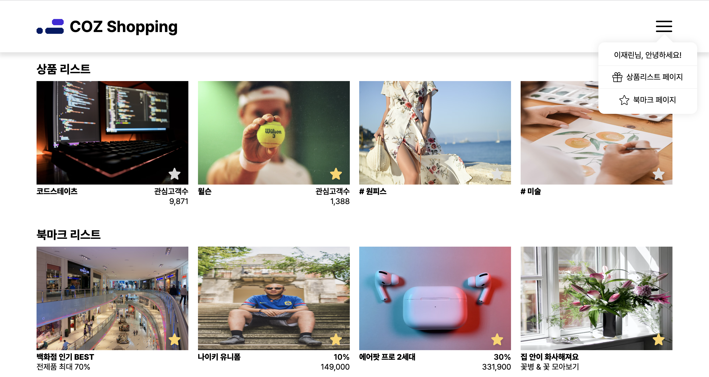

# Coz Shopping Project

CodeStates FEB 44기 쇼핑몰 구현 솔로 프로젝트입니다.

## Stack


## 📅 기간

2023.05.12 ~ 2022.05.18

## 프로젝트 설명




### Why you used Tech Stack

- React SPA(Single Page Application)로 구현한 쇼핑몰 프로젝트입니다.
- CRA 환경과 비슷하게 react-scripts를 사용하여 프로젝트를 빌드하였습니다.
- 페이지 라우팅을 위해 react-router를 사용했습니다.
- 코드의 간결성을 위해서 fetch 대신 axios를 사용했습니다.
- 하나의 컴포넌트 안에서 HTML과 CSS 구조를 파악하기 쉬운 Styled-Component를 사용했습니다.
- 전역 상태를 사용하지 않은 이유: 해당 프로젝트는 페이지 규모가 작기 때문에 캐싱 라이브러리를 사용하되, 전역상태를 따로 사용하지 않아도 된다고 생각했습니다. 그렇기 때문에 컴포넌트에서 데이터를 받아온 후 useState로 관리하였습니다.

<br />

## 프로젝트 중 직면한 문제

### ✅ `<Link>`에 스타일을 추가하는 방법

```jsx
<FlexWrapper>
  <Link to="/" style={{ display: 'flex', alignItems: 'center' }}>
    <Logo src="/images/logo.png" alt="logo" />
    <Title>COZ Shopping</Title>
  </Link>
  <Hamburger src="/images/hamburger.svg" onClick={toggleDropdown} />
  {isDropdown && <MenuBar />}
</FlexWrapper>
```

react-router-dom에서 제공하는 Link를 사용해 페이지를 라우팅 시키는데, Logo와 Title 태그를 `display:flex` 처리를 하고 싶었습니다. 그러기 위해선, Link에 인라인 스타일을 지정해야했습니다. 하지만 인라인 스타일을 넣는 것은 코드의 가독성과 통일성을 떨어뜨릴 뿐만 아니라 안티패턴이라고 생각했습니다.

결론적으로 Link 안에 div 태그로 감싸고 감싼 태그에 `display: flex`를 적용시키는 방법으로 해결했습니다.

```jsx
<Link to="/">
  <Home>
    <Logo src="/images/logo.png" alt="logo" />
    <Title>COZ Shopping</Title>
  </Home>
</Link>
```

<br />

+) 불필요한 div 태그를 사용해서 스타일을 지정하기보다 NavLink를 사용해서 `activeStyle={style}`을 지정하는 것이 더 좋은 방법이라고 생각이 들었습니다.

```jsx
const style = {
  fontWeight:'900',
  color:'red',
 }

 <NavLink to="/" activeStyle={style}>
  <Logo src="/images/logo.png" alt="logo" />
  <Title>COZ Shopping</Title>
 </NavLink>
```

👉🏻 [NavLink](https://reactrouter.com/en/main/components/nav-link)

<br />

### ✅ MainPage 컴포넌트 무한로딩

localStorage에서 받아온 값을 bookmarkProducts에 저장하는 로직을 구현하고 싶었습니다. 구현 코드는 다음과 같습니다.

```jsx
import checkBookmarkedItem from '../utils/checkBookmarkedItem';
// import addBookmarkProducts from '../utils/addBookmarkProducts';

export default function MainPage() {
  const products = useFetchProductListProducts();
  const [bookmarkProducts, setBookmarkProducts] = useState([]);

  useEffect(() => {
    // 처음에 localStorage를 가져올 때 bookmarkProduct가 있으면 가져오고, 아니면 빈 배열로 가져오기
    const ItemData =
      JSON.stringify(localStorage.getItem('bookmarkProduct')) || [];

    setBookmarkProducts(ItemData);
  }, [bookmarkProducts]);

  // ...
}
```

코드를 실행할 경우, 컴포넌트가 무한으로 리렌더링되는 문제가 생겼습니다.

무한 로딩이 발생하는 이유는 다음과 같습니다.

1. 초기 렌더링 시 useEffect가 실행됩니다.
2. useEffect의 의존성 배열 [bookmarkProducts]에 의해 bookmarkProducts의 값이 변경되면 useEffect가 다시 실행됩니다.
3. useEffect 내부에서 setBookmarkProducts 함수를 호출하여 bookmarkProducts 상태를 업데이트합니다.
4. bookmarkProducts 상태가 업데이트되면 다시 useEffect가 실행됩니다.
   이전과 동일한 내용의 bookmarkProducts 값을 가져오기 때문에 무한한 반복이 발생하고 무한로딩이 발생합니다.

저의 고민은 '북마크에 아이템을 추가하면 localStorage의 리스트가 변경되었기 때문에 변경을 감지하고 리렌더링을 해줘야하는데?'였습니다.

해결 방법은 데이터를 가져오는 함수를 만들어서 데이터를 리턴하는 함수를 외부로 작성하였습니다.

```jsx
export default function useFetchBookmarkProducts() {
  const bookmarkProducts =
    JSON.parse(localStorage.getItem('bookmarkProducts')) || [];

  return bookmarkProducts;
}
```

그리고 bookmarkPage 컴포넌트에서 데이터를 불러오는 함수를 호출하는 것으로 구현하였습니다.

## 개선해야하는 기능

- 상품리스트에서 20개씩 보여 준 후, 추가로 데이터를 렌더링하는 무한스크롤 기능을 구현했습니다. 여기서 해결하지 못한 문제는 전체 데이터를 렌더링하지 않았을 때 타입별 상품 리스트를 하게 되면 타입별 상품 리스트가 보이지 않습니다.

## 배운 점

- 데이터를 한 번에 받아온 후, 무한스크롤을 구현하는 방법에 대해서 고민해 볼 수 있는 시간이었습니다.
